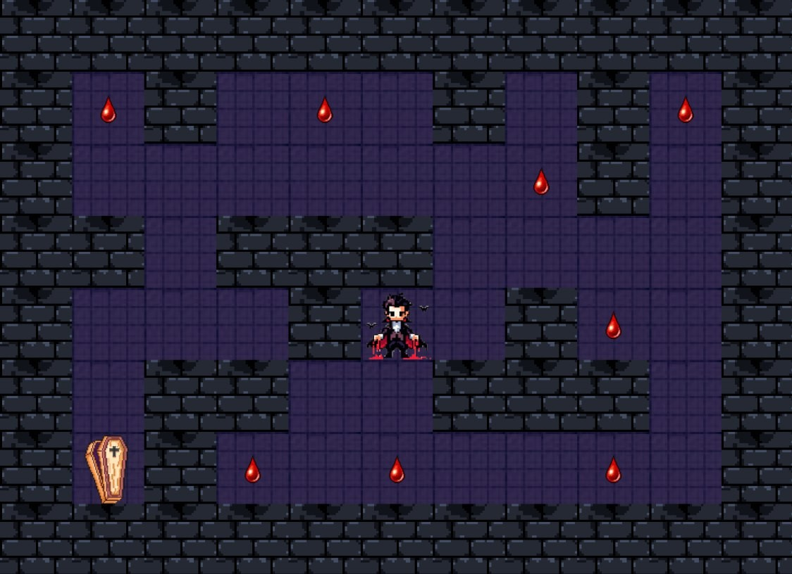

# So-Long

A simple 2D game developed in C using the MiniLibX graphics library. 
The player navigates through a map, collects items, and reaches the exit. Created as part of the 42 school curriculum.


## 🎮 Game Overview

- The player moves using keyboard inputs (WASD or arrow keys).
- The goal is to collect all collectibles and reach the exit.
- The map must be valid (rectangular, surrounded by walls, with exactly one player start, at least one collectible, and one exit).


## 🗺️ Map Format
Each map must follow these rules:

- The file must have a `.ber` extension.
- The map must be **rectangular** (all rows have the same length).
- The map must be **surrounded by walls** (`1` on all edges).
- The map must contain:
  - Exactly **one** player (`P`)
  - Exactly **one** exit (`E`)
  - **At least one** collectible (`C`)
- Only the following characters are allowed:
  - `1` – Wall  
  - `0` – Floor / Empty space  
  - `P` – Player start position
  - `C` – Collectible
  - `M` – Enemy / Monster (included if bonus part implemented)  
  - `E` – Exit  


### ✅ Example Map
```
111111
1P0C01
100001
1C0E11
111111
```


## ✨ Bonus Features

- 🐍 **Enemy** – Added a patrolling enemy that causes the player to lose the game if they touch it.
- 🌟 **Animations** – Implemented basic sprite animations for smoother visual effects.
- ⏱️ **Move Counter on Screen** – The number of player moves is displayed on the game window in real time.

---




